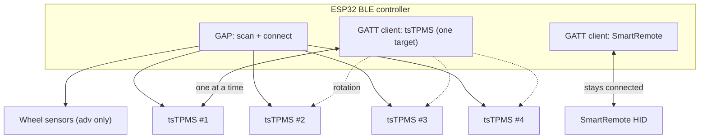
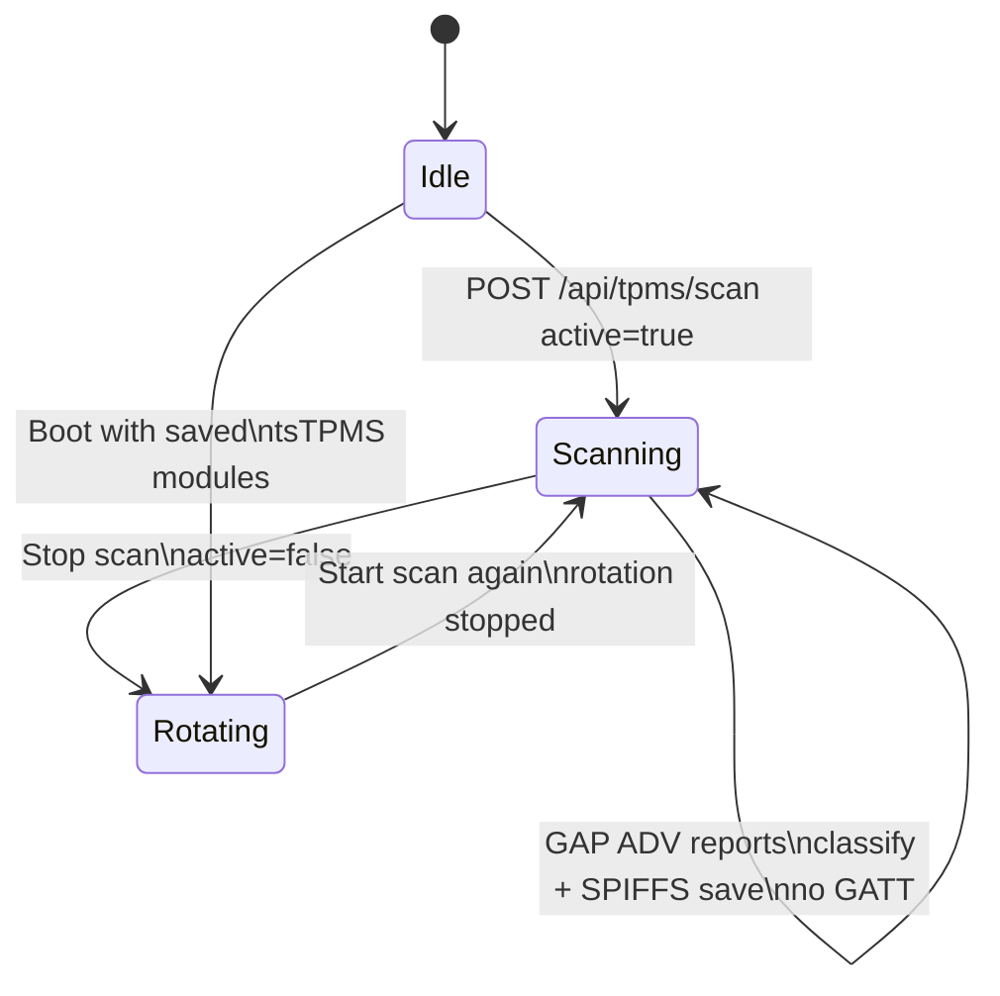
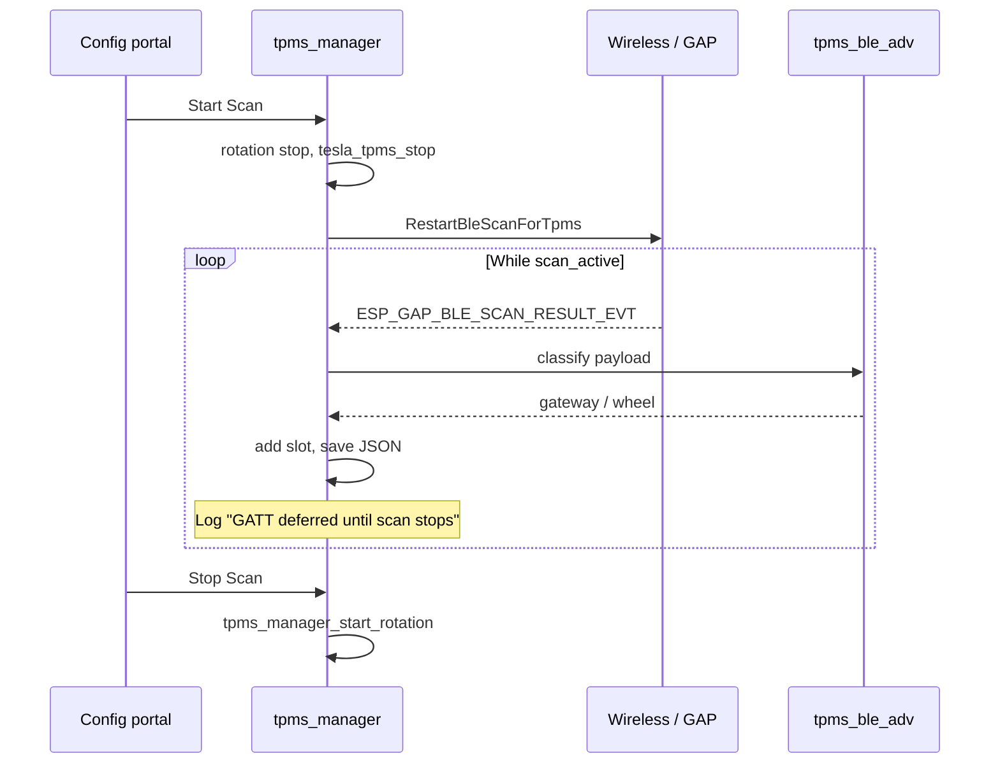
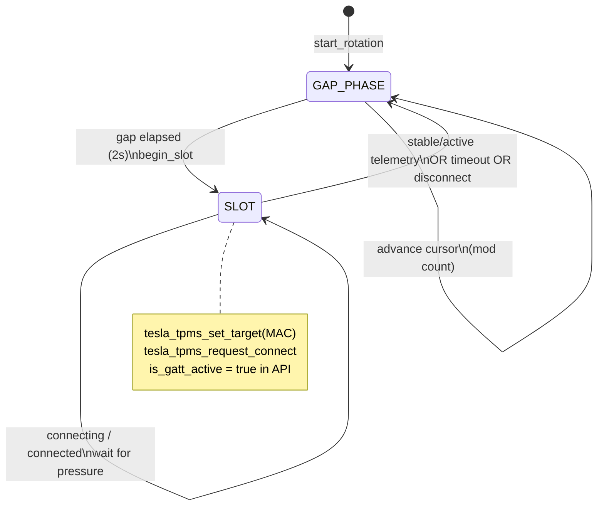
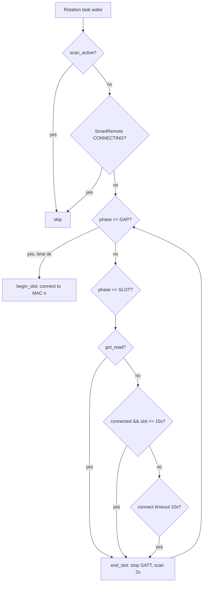
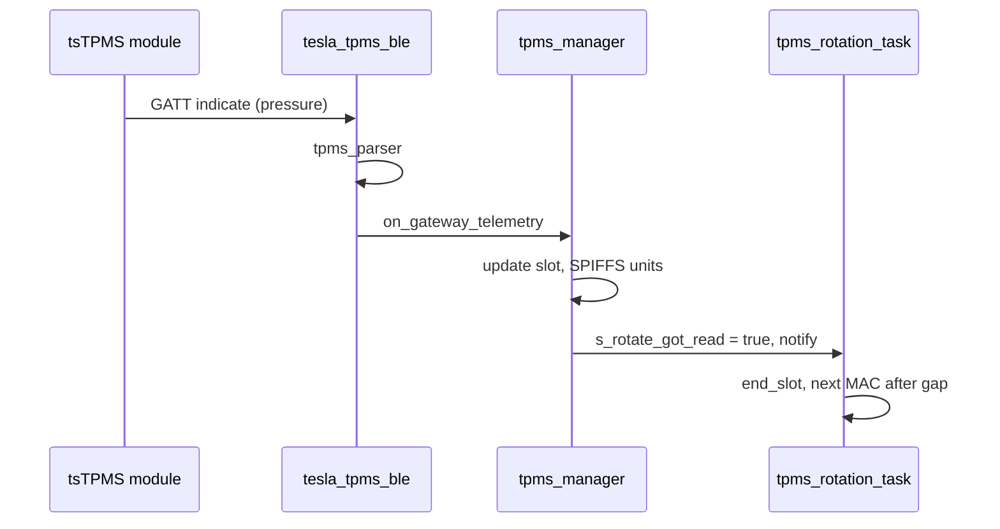
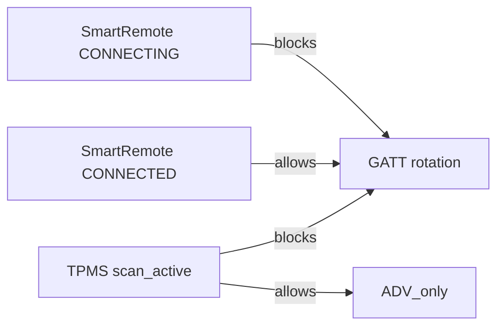
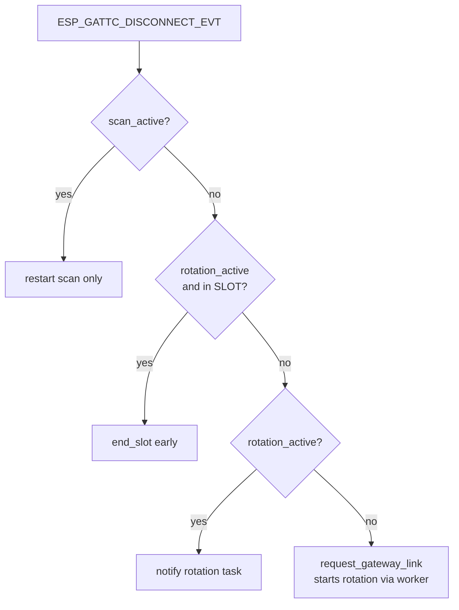

# TPMS BLE architecture and flow charts

COBRA_HU_185 uses a **single ESP32 BLE controller** shared by:

- **SmartRemote** — persistent GATT client (HID + battery) in `main/Wireless/Wireless.c`
- **tsTPMS modules** — one GATT client at a time in `main/TPMS/tesla_tpms_ble.c`, orchestrated by `main/TPMS/tpms_manager.c`
- **Background scan** — discovers advertisers and updates wheel-sensor slots from manufacturer data

Four simultaneous tsTPMS GATT connections plus SmartRemote is **not** possible on one radio. After portal discovery, firmware **round-robins** through known tsTPMS MACs (~15 s per slot, ~2 s gap).

## Timing constants

| Constant | Value | Purpose |
|----------|-------|---------|
| `TPMS_ROTATE_SLOT_MS` | 15 s | Max time connected per tsTPMS before next MAC |
| `TPMS_ROTATE_GAP_MS` | 2 s | BLE scan window between GATT slots |
| `TPMS_ROTATE_CONNECT_TIMEOUT_MS` | 10 s | Give up connect if not connected |

Primary GATT MAC (portal **Set live**) is polled **first** in the rotation queue when set.

---

## High-level radio sharing

---

## Portal discovery scan (Start / Stop Scan)

**Start Scan:** advertising only — no GATT. New MACs saved to SPIFFS `/config/tpms_sensors.json`.

**Stop Scan:** stops discovery scan, starts **GATT rotation** if any `is_gateway` (tsTPMS) entries exist.

---

## GATT rotation state machine

Worker task: `tpms_rot` (`tpms_rotation_task` in `tpms_manager.c`).

Queue order: tire positions LF → RF → LR → RR; **primary_gatt_mac** sorts first when configured.

---

## Telemetry path

---

## SmartRemote coexistence

| SmartRemote state | Portal scan | GATT rotation |
|-------------------|-------------|---------------|
| CONNECTED | Allowed (scan only) | Allowed (one tsTPMS GATT) |
| CONNECTING | Scan OK | **Deferred** until connected |
| Disconnected | Scan OK | Rotation continues; remote reconnect uses scan |

Policy: block tsTPMS GATT only while remote is **connecting**, not while **connected** (`tpms_gateway_link_blocked_internal`).

---

## Disconnect handling

---

## Config portal API

`GET /api/tpms` includes:

- `scan_active` — discovery mode
- `rotation_active` — round-robin running
- per sensor: `is_gatt_active` — MAC currently in GATT slot

UI shows **Reading** on the active row and status *Rotating GATT reads across sensors…* when idle after scan.

---

## Key source files

| File | Role |
|------|------|
| `main/TPMS/tpms_manager.c` | Scan, persistence, rotation task, snapshots |
| `main/TPMS/tesla_tpms_ble.c` | Single GATT client to tsTPMS |
| `main/TPMS/tpms_ble_adv.c` | Gateway vs wheel advertisement parsing |
| `main/Wireless/Wireless.c` | SmartRemote GATT, shared GAP scan |
| `main/Config_Portal/Config_Portal.c` | REST `/api/tpms` |
| `main/Config_Portal/web/service.js` | TPMS panel UI |

---

## Expected log patterns (test)

1. **Start Scan** — `Discovered gateway tsTPMS … (GATT deferred until scan stops)`; no `[TPMS] GATT client started`.
2. **Stop Scan** — `GATT rotation started (N tsTPMS modules, 15000 ms per slot)`; cycling `GATT rotation slot k/N` and `STABLE pressure`.
3. **SmartRemote connected** — rotation still advances; no perpetual `Gateway GATT deferred` while remote is only connected.
